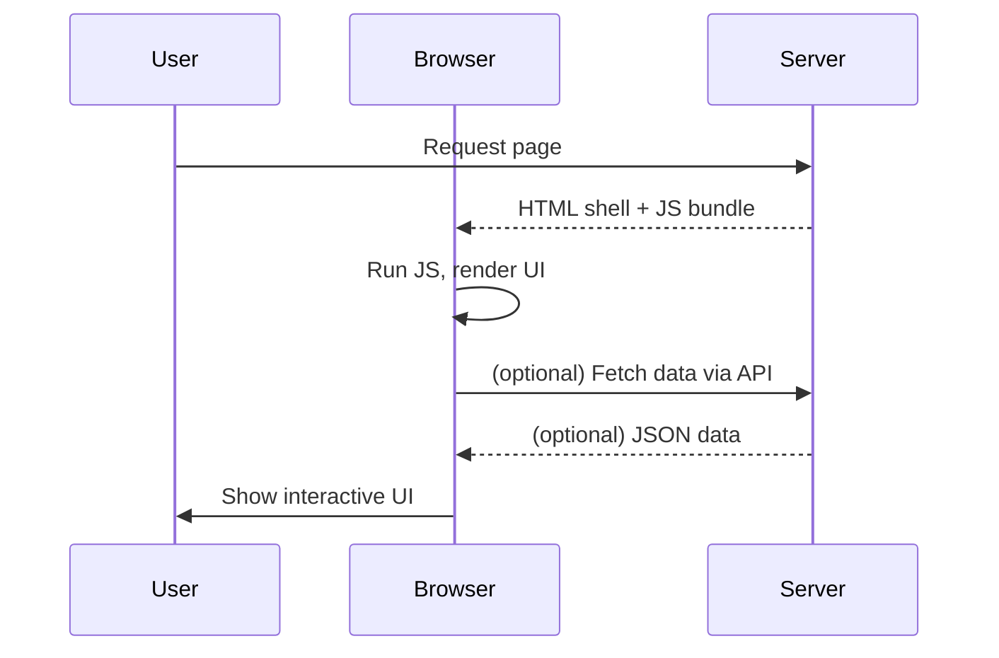
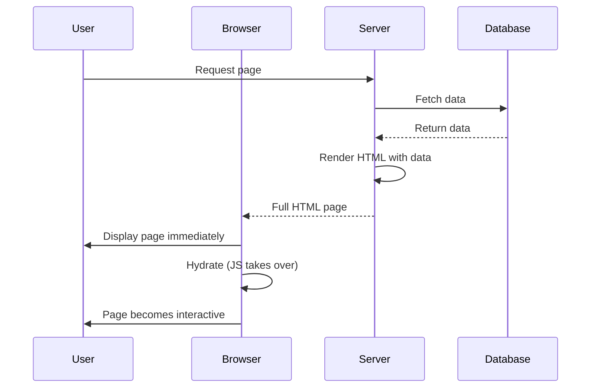
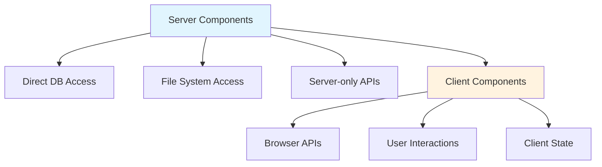
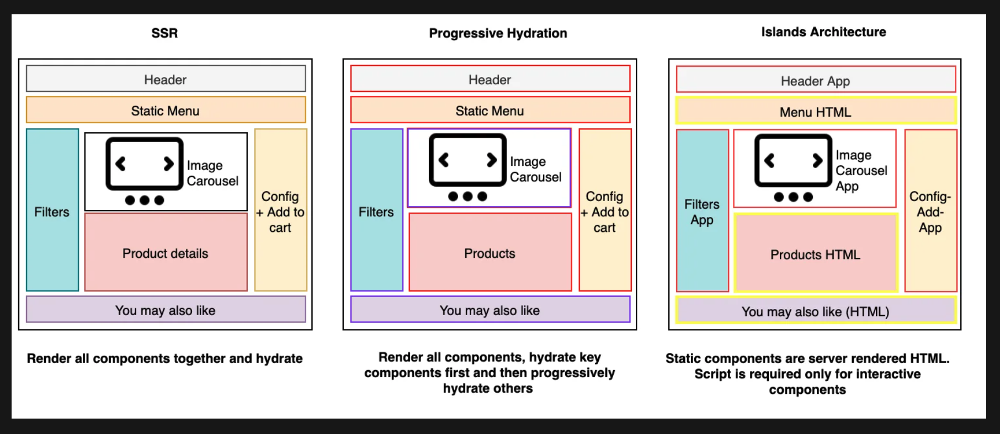

# Web Rendering Patterns

How your code paint the browser

---

# What is Rendering?

- Process of converting {data} and code into a
- Can be done on client or server or both or partially
- All has pros and cons

---

# The Patterns

- Static Websites
- CSR
- SSR
- PPR
- Island
- RSC
- SPA
- SSG
- ISR

---

# Static Websites

### The Simplest Form:

- HTML files with `.html` extension
- Served directly by web servers (nginx, Apache)
- Can even open directly in browser with `file://`

```html
<!-- index.html -->
<!DOCTYPE html>
<html>
  <head>
    <title>Static Site</title>
  </head>
  <body>
    <h1>This is static content</h1>
    <p>No server processing needed!</p>
  </body>
</html>
```

<!--
This explanation helps establish the baseline before diving into more complex patterns. It makes it clear that:

1. **SSG** is essentially generating these static HTML files programmatically at build time
2. **CSR** replaced this with JavaScript-generated HTML
2. **CSR** replaced this with JavaScript-generated HTML
2. **CSR** replaced this with JavaScript-generated HTML
3. **SSR** generates these HTML files on-demand per request
4. **RSC** is a hybrid that streams partially static, partially dynamic content

You could even add a comparison:
- **1995**: Write HTML by hand → serve via Apache
- **2024**: Generate HTML with React/Next.js → serve via CDN
- **Result**: Still just HTML files, but created differently!

This grounding in fundamentals will help your audience better understand why we've come full circle with SSG and why it's so performant.
 -->

---

## Client Side Rendering (CSR)?

- The browser downloads a minimal HTML file, then loads JavaScript to render the UI.
- All rendering happens in the user's browser, not on the server.
- Popular frameworks: **React**, **Vue**, **Angular**.

---

## How does CSR work?

1. User requests a page
2. Server sends a basic HTML shell and JavaScript bundle
3. Browser runs the JavaScript, which generates the UI and fetches data as needed

```html
<!-- index.html (CSR) -->
<body>
  <div id="app"></div>
  <script src="main.js"></script>
</body>
```

---



---

Bundle use on this to transform specific library code to vanilla JavaScript:
Examples

- [RSPACK](https://repl.rspack.rs/)
- [Vite](https://vitejs.dev/)
- [esbuild](https://esbuild.github.io/)

---

## Pros & Cons of CSR

**Pros:**

- Rich, interactive user experiences
- Fast navigation after initial load (SPA behavior)
- Great for web apps with lots of client-side logic

**Cons:**

- Slower initial load (blank page until JS loads)
- Worse SEO by default (content not in initial HTML)
- Heavier reliance on JavaScript

---

## When to use CSR?

- Apps with lots of interactivity (dashboards, editors)
- When SEO is not a top priority
- When you want a SPA-like experience

---

## Server Side Rendering (SSR)

- The server generates the full HTML for a page on each request.
- The browser receives a fully rendered page, which can be displayed immediately.
- Hydration happens on the client side, where JavaScript takes over and makes the page interactive.
- Popular frameworks: **Next.js**, **Nuxt.js**
- Supports SEO out of the box (search engines can crawl the content)

---



---

### Example

```ts
// Next.js SSR example
export async function getServerSideProps() {
  const data = await fetchData();
  return { props: { data } };
}

export default function Page({ data }: Props) {
  return <div>{data.content}</div>;
}
```

---

### You can achieve the same with Vite and react-dom/server [ViteSSR](https://github.com/bluwy/create-vite-extra/tree/master/template-ssr-react)

```tsx
// App.tsx
import React from "react";

export default function App() {
  return <div>Hello, world!</div>;
}
```

```tsx
// entry-server.tsx
import { StrictMode } from "react";
import { renderToString } from "react-dom/server";
import App from "./App";

export function render(_url) {
  const html = renderToString(
    <StrictMode>
      <App />
    </StrictMode>
  );
  return { html };
}
```

---

````tsx
// entry-client.tsx
import './index.css'
import { StrictMode } from 'react'
import { hydrateRoot } from 'react-dom/client'
import App from './App'

hydrateRoot(
  document.getElementById('root') as HTMLElement,
  <StrictMode>
    <App />
  </StrictMode>,
)```
````

Streaming

```tsx
export function render(_url: string, options?: RenderToPipeableStreamOptions) {
  return renderToPipeableStream(
    <StrictMode>
      <App />
      <vite-streaming-end></vite-streaming-end>
    </StrictMode>,
    options
  );
}
```

---

React APIs

- [hydrateRoot](https://react.dev/reference/react-dom/client/hydrateRoot)
- [renderToString](https://react.dev/reference/react-dom/server/renderToString)
- [renderToPipeableStream](https://react.dev/reference/react-dom/server/renderToPipeableStream)
- [renderToStaticMarkup](https://react.dev/reference/react-dom/server/renderToStaticMarkup)

---

## Static Site Generation (SSG)

- HTML pages are pre-generated at **build time**, not per request
- The browser receives a fully rendered page that displays immediately
- Zero JavaScript required for initial render (optional for interactivity)
- Content is baked into HTML → excellent **SEO** and **performance**
- Popular frameworks: **Next.js**, **Nuxt.js**, **Astro**, **Gatsby**, **11ty**
- Perfect for content sites, blogs, documentation, and marketing pages

---

Example NextJS SSG

```tsx
export default function Blog({ posts }) {
  // Render posts...
}

// This function gets called at build time
export async function getStaticProps() {
  // Call an external API endpoint to get posts
  const res = await fetch("https://.../posts");
  const posts = await res.json();

  // By returning { props: { posts } }, the Blog component
  // will receive `posts` as a prop at build time
  return {
    props: {
      posts,
    },
  };
}
```

---

## React Server Components (RSC)

- Components that run **exclusively on the server**, never sent to client
- Server components can directly access databases, file systems, APIs
- Client components handle interactivity and browser-only features
- **Zero JavaScript bundle** for server components → smaller client bundles
- Seamless composition: server components can render client components
- Currently available in **Next.js App Router** and experimental React frameworks

---

### RSC Example

```tsx
// ServerComponent.tsx (runs on server)
import { db } from "./database";

export default async function UserProfile({ userId }) {
  // Direct database access on server
  const user = await db.users.findById(userId);

  return (
    <div>
      <h1>{user.name}</h1>
      <p>{user.email}</p>
      {/* This client component handles interactivity */}
      <LikeButton postId={user.latestPost} />
    </div>
  );
}
```

---

```tsx
// LikeButton.tsx (client component)
"use client";
import { useState } from "react";

export default function LikeButton({ postId }) {
  const [liked, setLiked] = useState(false);

  return (
    <button onClick={() => setLiked(!liked)}>{liked ? "❤️" : "🤍"} Like</button>
  );
}
```

---



---

### RSC Payload

RSC doesn't send HTML - it sends a **serialized component tree**:

```json
{
  "type": "div",
  "props": {
    "children": [
      {
        "type": "h1",
        "props": { "children": "John Doe" }
      },
      {
        "type": "p",
        "props": { "children": "john@example.com" }
      },
      {
        "type": "$L1", // Reference to client component
        "props": { "postId": 123 }
      }
    ]
  }
}
```

---

- **Streamable**: Components render as they're ready
- **Resumable**: Client can reconstruct the React tree
- **Selective hydration**: Only client components need JavaScript
- **Efficient**: No duplicate data fetching between server/client

---

## Island Architecture

- Isolate interactive components on the client
- Server components render static content
- Client components handle dynamic behavior
- Reduces JavaScript bundle size
- Improves performance and user experience

---

### Hydration?

Hydration is the process of attaching event listeners and making a server-rendered page interactive on the client side.

- 

<!-- A server rendered application uses the server to generate the HTML for the current navigation. Once the server has completed generating the HTML contents, which also contains the necessary CSS and JSON data to display the static UI correctly, it sends the data down to the client. Since the server generated the markup for us, the client can quickly parse this and display it on the screen, which produces a fast First Contentful Paint!

Although server rendering provides a faster First Contentful Paint, it doesn’t always provide a faster Time To Interactive. The necessary JavaScript in order to be able to interact with our website hasn’t been loaded yet. Buttons may look interactive, but they aren’t interactive (yet). The handlers will only get attached once the JavaScript bundle has been loaded and processed. This process is called hydration: React checks the current DOM nodes, and hydrates the nodes with the corresponding JavaScript. -->

---


