# ~~React~~ Web Rendering Patterns

How your code paints the browser

by: Abbas
Software Engineer at BloomThis

---

# What is Rendering?

- Process of converting data and code into visual output
- Can be done on client, server, build time, or hybrid approaches

---

# The Evolution of Web Rendering


---

# The Patterns We'll Cover

1. **Static Websites** - The foundation
2. **Client-Side Rendering (CSR)** - JavaScript takes over
3. **Server-Side Rendering (SSR)** - HTML on each request
4. **Static Site Generation (SSG)** - Pre-built at build time
5. **Incremental Static Regeneration (ISR)** - SSG + dynamic updates
6. **React Server Components (RSC)** - Server components revolution
7. **Island Architecture** - Selective interactivity

---

# Static Websites

### The Simplest Form

- HTML files served directly by web servers (nginx, Apache)
- Zero server-side processing required
- Can open directly in browser with `file://`
- Foundation for all other patterns

```html
<!-- index.html -->
<!DOCTYPE html>
<html>
  <head>
    <title>Static Site</title>
  </head>
  <body>
    <h1>This is static content</h1>
    <p>No server processing needed!</p>
  </body>
</html>
```

---

## Static Website Rendering Flow

```mermaid {scale: 0.6, alt: 'Static Site Sequence'}
sequenceDiagram
  participant User
  participant Browser
  participant Server
  User->>Server: Request page
  Server-->>Browser: Pre-built HTML file
  Browser->>Browser: Parse HTML → DOM
  Browser->>Browser: Parse CSS → CSSOM
  Browser->>Browser: Create Render Tree
  Browser->>Browser: Layout & Paint
  Browser->>User: 🎉 Page visible immediately
  Note over Browser: No JavaScript needed<br/>No hydration required
```



---

## Pros & Cons of Static Sites

**Pros:**

- Fastest possible loading times
- Most secure (no server-side code)
- Cheapest to host (CDN only)
- Perfect SEO (content in HTML)

**Cons:**

- No dynamic content without rebuild
- Limited interactivity
- Manual updates required
- No user-specific content

---

# Client-Side Rendering (CSR)

- Browser downloads minimal HTML shell + JavaScript bundle
- All rendering happens in the browser, not on the server
- Popular frameworks: **React**, **Vue**, **Angular**
- Enables rich, interactive web applications

---

## CSR Rendering Flow


---

## Example - React CSR

```html
<!-- index.html (CSR) -->
<body>
  <div id="app"></div>
  <script src="main.js"></script>
</body>
```

Modern CSR requires bundlers to compile code:

- **[Vite](https://vitejs.dev/)** - Fast development server
- **[RSPACK](https://repl.rspack.rs/)** - Rust-based bundler
- **[esbuild](https://esbuild.github.io/)** - Go-based bundler
- **[Webpack](https://webpack.js.org/)** - JavaScript module bundler - The OG

---

## Pros & Cons of CSR

**Pros:**

- Rich, interactive user experiences
- Fast navigation after initial load (SPA behavior)
- Great for dashboard-style applications
- No server processing per request

**Cons:**

- Slower initial load (blank page until JS loads)
- Poor SEO by default (content not in HTML)
- Relies heavily on JavaScript
- Accessibility challenges

---

# Server-Side Rendering (SSR)

- Server generates full HTML for each request
- Browser receives complete page that displays immediately
- JavaScript then **hydrates** to add interactivity
- Popular frameworks: **Next.js**, **Nuxt.js**, **SvelteKit** - Meta Frameworks

---

## SSR Rendering Flow


---

## SSR Example - NextJS

```tsx
// Next.js SSR example
export async function getServerSideProps() {
  const data = await fetchUserData();
  return { props: { data } };
}

export default function Page({ data }) {
  return (
    <div>
      <h1>{data.title}</h1>
      <p>{data.content}</p>
    </div>
  );
}
```

---

## SSR with Vite

```tsx
// entry-server.tsx
import { renderToString } from "react-dom/server";
import App from "./App";

export function render(_url) {
  const html = renderToString(<App />);
  return { html };
}
```

```tsx
// entry-client.tsx - Hydration
import { hydrateRoot } from "react-dom/client";
import App from "./App";

hydrateRoot(document.getElementById("root"), <App />);
```

---

## React Server Rendering APIs

- **[renderToString](https://react.dev/reference/react-dom/server/renderToString)** - Synchronous rendering
- **[renderToPipeableStream](https://react.dev/reference/react-dom/server/renderToPipeableStream)** - Streaming
- **[hydrateRoot](https://react.dev/reference/react-dom/client/hydrateRoot)** - Client hydration
- **[renderToStaticMarkup](https://react.dev/reference/react-dom/server/renderToStaticMarkup)** - Static HTML only

---

## Pros & Cons of SSR

**Pros:**

- Excellent SEO (content in HTML)
- Fast First Contentful Paint
- Works without JavaScript
- Dynamic, personalized content

**Cons:**

- Higher server costs (CPU usage per request)
- Slower Time to Interactive (hydration required)
- More complex setup and deployment
- Server state management complexity

---

# Static Site Generation (SSG)

- HTML pages pre-generated at **build time**, not per request
- Browser receives fully rendered page that displays immediately
- Zero JavaScript required for initial render (optional for interactivity)
- Popular frameworks: **Next.js**, **Nuxt.js**, **Astro**, **Gatsby**, **11ty**

---

## SSG Example - Next.js

```tsx
export default function Blog({ posts }) {
  return (
    <div>
      {posts.map((post) => (
        <article key={post.id}>
          <h2>{post.title}</h2>
          <p>{post.excerpt}</p>
        </article>
      ))}
    </div>
  );
}

// This runs at BUILD TIME
export async function getStaticProps() {
  const res = await fetch("https://api.example.com/posts");
  const posts = await res.json();

  return {
    props: { posts },
  };
}
```

---

## Pros & Cons of SSG

**Pros:**

- Fastest possible loading (pre-built HTML)
- Perfect SEO (content baked into HTML)
- Cheap hosting (just static files)
- Secure (no server-side vulnerabilities)
- Excellent CDN caching

**Cons:**

- Content updates require rebuilds
- Slow builds for large sites
- No real-time dynamic content
- No user-specific personalization

---

# Incremental Static Regeneration (ISR)

**What if you want dynamic content with SSG performance?**

ISR combines SSG and SSR benefits:

- Pages generated at build time like SSG
- Can be regenerated **on-demand** or periodically
- Serves stale content while regenerating in background
- Introduced in Next.js 12.1

---

## ISR Example

```tsx
export async function getStaticProps({ params }) {
  const post = await getPostById(params.id);

  return {
    props: { post },
    // Regenerate page at most once per hour
    revalidate: 3600,
  };
}

export async function getStaticPaths() {
  const posts = await getAllPosts();
  const paths = posts.map((post) => ({
    params: { id: post.id.toString() },
  }));

  return {
    paths,
    fallback: "blocking", // Generate missing pages on-demand
  };
}
```

---

## What is Hydration?

**Hydration** is the process of attaching event listeners and state to server-rendered HTML.

```tsx
// Server renders this to HTML:
<button>Click me</button>

// Client hydration adds interactivity:
<button onClick={() => setCount(count + 1)}>
  Click me
</button>
```

**3 Types of Hydration:**

- **Progressive** - Components hydrate as they're ready
- **Partial** - Only some components hydrate
- **Selective** - Hydrate based on user interaction

---

# React Server Components (RSC)

- Components run **exclusively on the server**, never sent to client
- Server components can directly access databases, file systems, APIs
- Client components handle interactivity and browser-only features
- **Zero JavaScript bundle** for server components
- Available in **Next.js App Router** and experimental frameworks

---

## RSC Example

```tsx
// ServerComponent.tsx (runs on server)
import { db } from "./database";

export default async function UserProfile({ userId }) {
  // Direct database access on server
  const user = await db.users.findById(userId);

  return (
    <div>
      <h1>{user.name}</h1>
      <p>{user.email}</p>
      {/* Client component for interactivity */}
      <LikeButton postId={user.latestPost} />
    </div>
  );
}
```

---

```tsx
// LikeButton.tsx (client component)
"use client";
import { useState } from "react";

export default function LikeButton({ postId }) {
  const [liked, setLiked] = useState(false);

  return (
    <button onClick={() => setLiked(!liked)}>{liked ? "❤️" : "🤍"} Like</button>
  );
}
```

---

## RSC Payload

RSC doesn't send HTML - it sends a **serialized component tree**:

```json
{
  "type": "div",
  "props": {
    "children": [
      {
        "type": "h1",
        "props": { "children": "John Doe" }
      },
      {
        "type": "$L1", // Reference to client component
        "props": { "postId": 123 }
      }
    ]
  }
}
```

---

**Benefits:**

- **Streamable** - Components render as ready
- **Resumable** - Client reconstructs React tree
- **Selective hydration** - Only client components need JS
- **Efficient** - No duplicate data fetching

---

# Island Architecture

**Components choose how and when to ship JavaScript**

- Server renders static content by default
- Interactive components become "islands" of interactivity
- Reduces JavaScript bundle size significantly
- Popular in **Astro**, **Deno Fresh**, **Qwik**

```tsx
// Static by default
<Header />
<BlogPost content={post} />

// Interactive islands
<SearchBox client:load />
<CommentForm client:visible />
<Newsletter client:idle />
```

---


---

## Island Architecture Benefits

- **Selective hydration** - Only interactive parts load JS
- **Faster loading** - Minimal JavaScript by default
- **Better performance** - Less parsing and execution
- **Progressive enhancement** - Works without JS

---

# Choosing the Right Pattern

| Pattern     | Best For              | Performance | SEO        | Complexity |
| ----------- | --------------------- | ----------- | ---------- | ---------- |
| **Static**  | Brochure sites, docs  | ⭐⭐⭐⭐⭐  | ⭐⭐⭐⭐⭐ | ⭐         |
| **CSR**     | Dashboards, apps      | ⭐⭐        | ⭐         | ⭐⭐       |
| **SSR**     | E-commerce, blogs     | ⭐⭐⭐      | ⭐⭐⭐⭐⭐ | ⭐⭐⭐⭐   |
| **SSG**     | Marketing, portfolios | ⭐⭐⭐⭐⭐  | ⭐⭐⭐⭐⭐ | ⭐⭐       |
| **ISR**     | News sites, CMSs      | ⭐⭐⭐⭐    | ⭐⭐⭐⭐⭐ | ⭐⭐⭐     |
| **RSC**     | Complex applications  | ⭐⭐⭐⭐    | ⭐⭐⭐⭐⭐ | ⭐⭐⭐⭐⭐ |
| **Islands** | Content + interaction | ⭐⭐⭐⭐⭐  | ⭐⭐⭐⭐   | ⭐⭐⭐     |

---


---

**Key Takeaway**: There's no one-size-fits-all solution. Choose the rendering pattern that best fits your:

- Performance requirements
- SEO needs
- Development complexity tolerance
- Team expertise

---

Extra

- [Ethan Niser explaining hydration issue](https://youtu.be/wski7bnpW8Y)
- [Hydration common issue solved](https://hydration-test.vercel.app/)
- [https://www.patterns.dev/](https://www.patterns.dev/)
- [https://web.dev/](https://web.dev/)

---

Thank you!

Find me here -> https://ismiabbas.xyz
